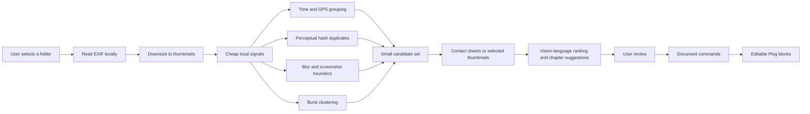

# Large Photo Library Roadmap — Not Implemented

The Build Week demo deliberately starts after photo selection: the bundled example has six image blocks, while AI drafting accepts 2–12. The often-described “1,000 travel photos” workflow is a product hypothesis and architecture direction, not a current feature.

## Proposed Pipeline

## What Should Stay Local

- file enumeration and temporary handles
- EXIF time, orientation, and GPS extraction
- thumbnail generation
- perceptual hashing and near-duplicate grouping
- simple blur/exposure scores
- burst detection and coarse time/location clusters

These steps are cheaper, faster, and more private than sending every original to a multimodal model. They reduce 1,000 originals to tens of groups and a much smaller representative set.

## Where Models Add Real Value

- compare a small number of representatives when conventional quality scores disagree
- describe semantic differences between otherwise similar clusters
- propose chapter boundaries from selected images plus user-supplied facts
- draft editable copy in the user’s voice
- optionally suggest non-destructive edits; actual image generation/editing requires separate consent and cost controls

## Browser Storage and Compute Decision

A browser does not need to put 1,000 full-resolution images in IndexedDB. A credible implementation would use the File System Access API where available, retain handles and derived thumbnails, process bounded batches in Web Workers, and discard intermediates. Safari/iOS support and mobile memory limits require a separate fallback, potentially a desktop companion.

Running CV in the browser is possible through WebAssembly or WebGPU runtimes, but model download size, warm-up time, device variance, battery use, and iOS memory pressure make it a poor one-day Build Week addition. The first experiment should use metadata and small classical algorithms before adding a neural model.

## Evaluation Gate

Do not build the full pipeline until a 100–300 photo prototype demonstrates all of the following:

1. at least 70% fewer photos require manual review;
2. users prefer the selected representatives to a simple time-based baseline;
3. processing completes on a typical laptop without uploading originals;
4. the user can correct groups and selections without fighting the system;
5. model cost and latency are bounded per trip.

If those gates fail, keep Plog as a six-to-twenty-image programmable story composer rather than becoming a photo-management product.
